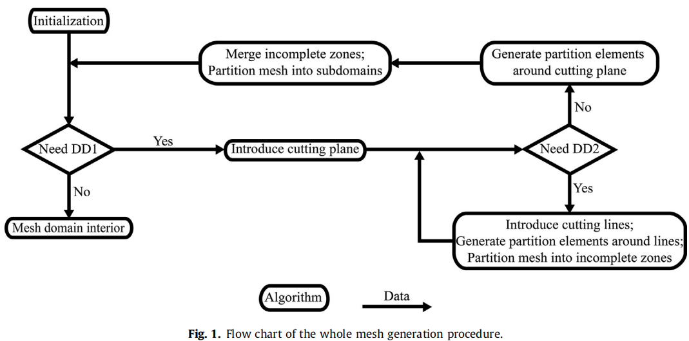
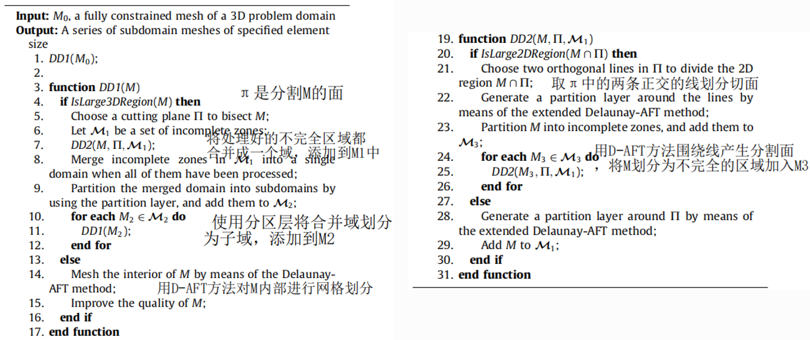
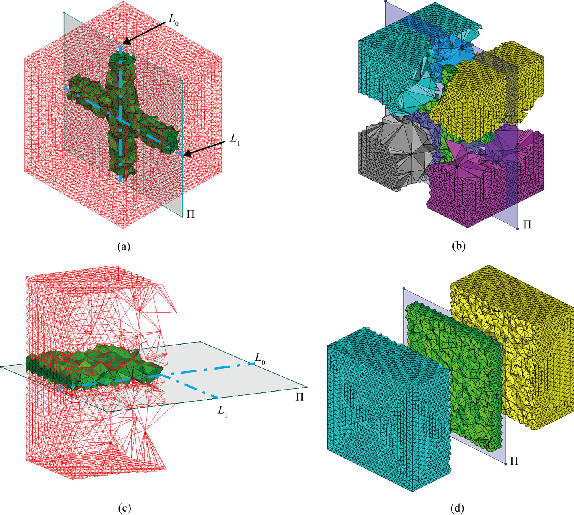
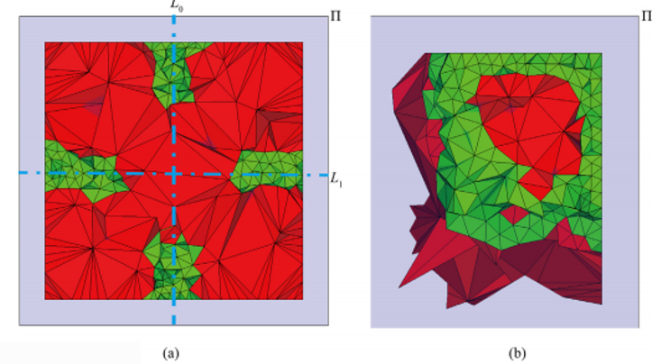
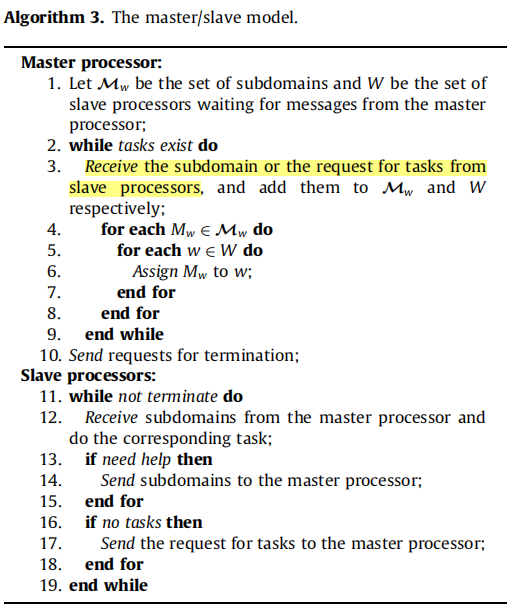
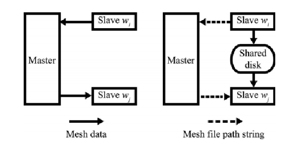
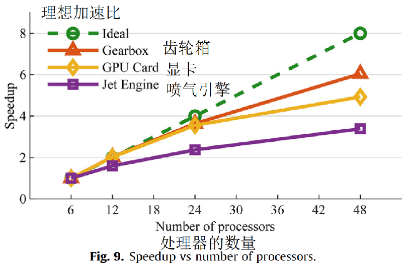
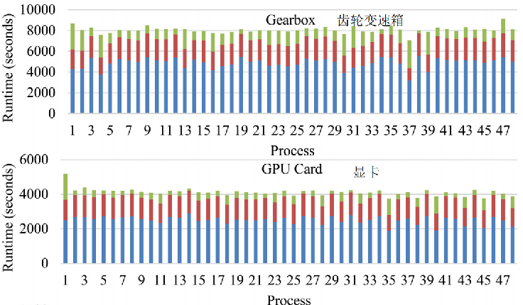
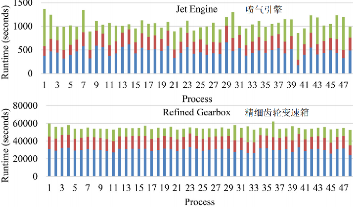
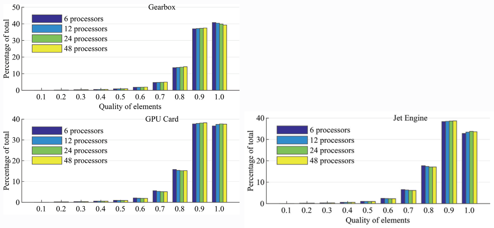

Fei Yu,Yan Zeng,Z.Q. Guan,S.H. Lo. A robust Delaunay-AFT based parallel method for the generation of large-scale fully constrained meshes[J]. Computers and Structures,2020,228.

# 摘要

本文研究者充分利用串行Delaunay-AFT网格生成器，<u>开发了一种在分布式存储的机器上生成大规模四面体网格的并行方法</u>。 

为了生成具有所需和保留属性的网格，<u>使用了一种基于Delaunay-AFT的域分解(DD)技术</u>。从覆盖问题域的Delaunay三角剖分(DT)开始，该技术创建了一层元素，将整个域划分为几个区域。将最初粗糙的网格域划分为了可以进行并行网格划分的子域的DTs。 当一个子域的大小小于用户指定的阈值，将用标准Delaunay-AFT方法进行网格划分。     

<u>设计了两级DD策略来提高了该算法的并行效率</u>。<u>还使用消息传递接口(MPI)实现了动态负载均衡方案</u>。 <u>引入了核心外网格划分，以适应过大的网格</u>，而这些网格不能由计算机的可用存储器(RAM)处理。 <u>对具有数千个表面贴片的各种复杂几何形状进行了数值试验，创建了拥有超过100亿个四面体元素的超大尺度网格</u>。 此外，不同DD操作次数生成的网格在质量上几乎相同：显示了自动分解算法的一致性和稳定性。

<!-- more -->

# 具体论文

## 并行域分解和网格产生算法

## 并行域分解和网格产生算法

## 一级域分解

（a）进行CDT分解的区域。

（b）扩展的Delaunay-AFT方法引入了一层形状良好的单元作为分离层。

（c）独立的并行处理器进行进一步的域分解。

（d）并行子域网格生成的中间阶段，三个处理器完成，一个正在进行。

## 二级域分解

(a) 引入L0,L1分割切割面。

(b) 将领域用L0,L1周围的分割元划分成四个不完全的区域。

(c)通过并行的处理器在平面Π周围生成分割面。

(d)不完全的区域合并成了单个区域，然后通过Π周围的分割元自动分为了两个子区域。

上图是二级域分解的直观情况，（a）是在切割线周围产生分割元，（b）是在切割面周围产生分割元

# 动态负载均衡

由于Delaunay-AFT法网格生成的速度与各种因素的组合有关，因此难以准确地评价网格划分工作。

因此，相比于静态负载分配，动态负载均衡策略更合适。

网格域被划分为比处理器数(Np)多得多的子域。 然后将处理器动态地分配进行网格生成。如算法3所示，基本实现结构是主/从模型。在这个模型中，主处理器接收请求，并指示从处理器执行它们，从处理器独立于其他从处理器运行。

# 核心外网格划分

 由于主从模型有很强的解耦性和简单性，所以核外的网格划分能通过改变消息传递的方式简单地实现。

网格数据被序列化之后使用MPI_Send和MPI_Recv方法在处理器之间传输数据。

但是，当从机需要发送网格数据给主机，然后主机需要广播数据给从机时，通信开销会变得非常大，这也是并行方法的瓶颈。

在本工作中，序列化的网格数据被转储到处理器之间共享的磁盘上，并将表示相应文件路径的字符串视为对需要传递的数据的代替，由于文件路径的字符串长度很小，主机通讯的时间可以忽略不计，所以通讯开销会变得很小。

同时，完成的网格立即导出以释放内存，这样，内存需求明显降低，因为只有正在处理的网格保存在RAM中。 

# 测试结果

## 加速比

分别对齿轮箱、显卡、喷气引擎进行了网格划分测试。

## 负载均衡

## 网格质量

网格质量通过以下公式定义：
$$
\sigma=3\frac{r_i}{r_c}
$$
其中$r_i$是内接圆半径，$r_c$是外接圆半径，$\sigma$越接近1，说明网格的形状越接近正四面体，质量越高，由于实际正四面体的内外接圆半径之比为$\frac{1}{3}$，所以乘上3归一化。

上图是三个模型在不同网格质量下的网格数目，可见并行对网格质量影响不大，生成网格大部分都为高质量网格。

 

 

 

