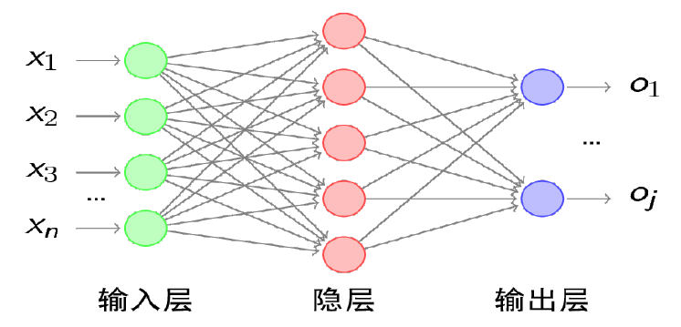
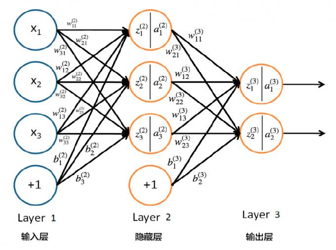
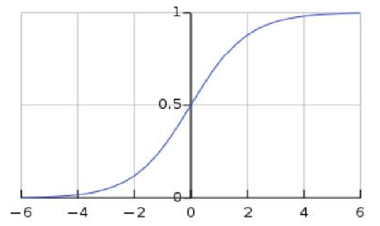
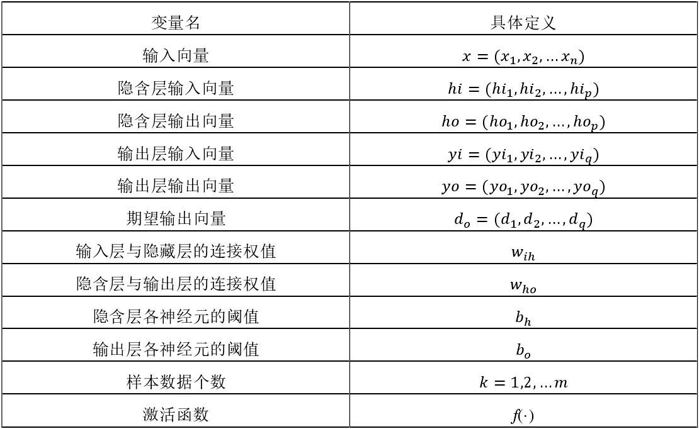

# BP神经网络简介

## 网络结构：

输入层、隐藏层（实际应用中可能不止一层）和输出层。

BP神经网络架构图

<!-- more -->

BP 神经网络里每层的神经元和下一层的神经元用线连接在一起，每条连接线都有一个对应的权重值 w。除了输入层，一般来说每个神经元还有对应的偏置b。BP 神经网络的计算架构如下图 ：

BP 神经网络计算架构图

每个神经元（除了输入层）都会有加权求和得到的输入值  z  ，以及将  z  通过  Sigmoid  函数（也即是激活函数）非线性转化后的输出值  a，z 和 a 的计算公式如下：
$$
z_{j}^{l}=\sum_{i=1 \ldots n} w_{i j} \cdot a_{i j}^{l-1}-b_{j}^{l}
$$

$$
a_{j}^{l}=f\left(z_{j}^{(l)}\right)=\frac{1}{1+e^{-z_{j}^{(l)}}}
$$

其中，变量 l 表示层和变量 j 表示的是第  j  个神经元，ij  则表示从编号为  i  的神经元到编号为  j  的神经元之间的连线——边，w  表示的是权重，b  表示的是偏置。BP 神经网络中使用激活函数的原因是因为线性模型（无法处理线性不可分的情况）的表达能力不够，故一般加入  Sigmoid  函数，来实现非线性转换得到神经元的输出值。

Sigmoid 函数图像如下：

sigmoid 函数图像 

Sigmoid 函数的值域为(0,1)。对于多分类任务，输出层的每个神经元可以表示是该分类的概率。当然还存在其他的激活函数如双曲正切函数 tanh 和广泛使用的 Relu 函数，他们的用途和优缺点也都各异。

# BP 神经网络算法

BP 神经网络是一种监督学习，训练预测模型时首先要利用梯度下降法逐层训练和更新网络的权值及阈值，通过训练使网络具备联想记忆和预测能力。 

BP 网络的训练过程如下：
1）输入样本以开始信号的正向传播，信号从输入层依次从前往后传递，经过隐藏层，最后传入输出层。 
2）判断是否将要转向反向传播阶段，具体为：输出层的观测值𝑦̌ =h(x)与期望的输出(y)不符，就进入反向传播阶段。 
3）误差反传：误差反向传播，利用梯度下降算法，不断修正各层单元的权值和阈值(w 或者 Θ)。 
4）最终结果：网络输出的误差减少到了另人满意的程度（或者已达到最大训练次数） 

在开始介绍 BP 神经网络的标准训练算法前，首先定义 BP 网络结构训练推导会用到的相关变量：我们假设输入层 X 包含 n 个神经元，隐含层 H 包含 p 个神经元，输出层 Y 包含 q 个神经元。 

相关变量的定义见下表：

由于在 BP 网络中，我们输入了 k 个样本分别是$x^{1}, x^{2}, \ldots, x^{\mathrm{k}}$。每个样本输入网络后，会得到观测值，例如第 k 个样本的观测值记为$yo_{o}(k)$，我们将观测值和期望值$d_o(k)$的差值的平方即定义为误差函数𝑒，如式：
$$
e=\frac{1}{2} \sum_{o=1}^{q}\left(d_{o}(k)-y o_{o}(k)\right)^{2}
$$
基于上面对各变量和对误差函数的定义，BP 神经网络训练的标准推导过程如下。 

第一步，初始化 BP 网络里的各个权值参数，具体来说就是给众权值初始分配一个(-1,1)内的随机数，并且利用设定的误差函数 e，给定计算精度值 ε 和最大学习次数 M。

第二步，要输入的待训练样本 k 如下式：
$$
\mathrm{x}(k)=\left(x_{1}(k), x_{2}(k), \ldots, x_{q}(k)\right)
$$
以及对应的期望输出如式：
$$
\mathrm{d}_{\mathrm{o}}(k)=\left(d_{1}(k), d_{2}(k), \ldots, d_{q}(k)\right)
$$
第三步，将样本输入，开始信号正向传播过程，计算各神经元的输入和输出:首先是隐藏层的输入和输出，分别为式：
$$
h i_{h}(k)=\sum_{i=1}^{n} w_{i h} x_{i}(k)-b_{h}, h=1,2, \ldots, p
$$

$$
h o_{h}(k)=f\left(h i_{h}(k)\right), h=1,2, \ldots p
$$

第四步，利用网络期望输出和实际输出，开始反向传播阶段，用来修正各神经元权值和阈值，计算误差函数对输出层的各神经元的偏导数$\delta_{o}(k)$，依据链式法则如下式：
$$
\frac{\partial O e}{\partial w_{h o}}=\frac{\partial e}{\partial y i_{o}} \frac{\partial y i_{o}}{\partial w_{h o}}
$$

$$
\frac{\partial y i_{o}(k)}{\partial w_{h o}}=\frac{\partial\left(\sum_{h}^{p} w_{h o} h o_{h}(k)-b_{o}\right)^{\wedge} 2}{\partial w_{h o}}=h o_{h}(k)
$$

$$
\begin{aligned}
\frac{\partial e}{\partial y i_{o}} &=\frac{\partial\left(\frac{1}{2} \sum_{o=1}^{q}\left(d_{o}(k)-y o_{o}(k)\right)\right)^{2}}{\partial y i_{o}}=-\left(d_{o}(k)-y o_{o}(k)\right) y o_{o}^{\prime}(k)=-\delta_{o}(k)
\end{aligned}
$$

第五步，误差继续反向传播至隐藏层，计算误差函数对隐含层各神经元的偏导数$\delta_{h}(k)$依然按照链式法则，可以列出如下等式：
$$
\frac{\partial e}{\partial w_{h o}}=\frac{\partial e}{\partial y i_{o}} \frac{\partial y i_{o}}{\partial w_{h o}}=-\delta_{o}(k) h o_{h}(k)
$$

$$
\frac{\partial e}{\partial w_{i h}}=\frac{\partial e}{\partial h i_{h}(k)} \frac{\partial h i_{h}(k)}{\partial w_{i h}}
$$

$$
\frac{\partial h i_{h}(k)}{\partial w_{i h}}=\frac{\partial\left(\sum_{i=1}^{n} w_{i h} x_{i}(k)-b_{h}\right)}{\partial w_{i h}}=x_{i}(k)
$$

$$
\frac{\partial e}{\partial h i_{h}(k)}=\frac{\partial\left(\frac{1}{2} \sum_{o=1}^{q}\left(d_{o}(k)-y o_{o}(k)\right)\right)^{2}}{\partial h o_{h}(k)} \frac{\partial h o_{h}(k)}{\partial h i_{h}(k)}=-\delta_{h}(k)
$$

第六步：修正隐藏层和输出层连接权值，步骤如下：
$$
\Delta w_{h o}(k)=-\mu \frac{\partial e}{\partial w_{h o}}=\mu \delta_{o}(k) h o_{h}(k)
$$

$$
\mathrm{w}_{\mathrm{ho}}^{N+1}=w_{h o}^{N}+\eta \delta_{o}(k) h o_{h}(k)
$$

第七步，修正输入层和隐藏层连接权值，步骤如下：
$$
\Delta w_{i h}(k)=-\mu \frac{\partial e}{\partial w_{i h}}=\mu \delta_{h}(k) x_{i}(k)
$$

$$
w_{i h}^{N+1}=w_{i h}^{N}+\eta \delta_{h}(k) x_{i}(k)
$$

第八步，计算当前的总体误差，表达式如下：
$$
\mathrm{E}=\frac{1}{2 m} \sum_{k=0}^{m} \sum_{o=1}^{q}\left(d_{o}(k)-y o_{o}(k)\right)^{2}
$$
第九步，判断当前的总体误差是否减少到预设值。如果达到要求或学习次数用尽，则结束训练算法。否则返回到第二步，进入新一轮学习。

# BP神经网络改进方法

## 提升训练效率 

BP 算法用梯度下降法求误差函数最小值，那么如果误差函数非正定，就一定会存在局部极小点，所以训练的结果不一定落入全局最小点，而是频繁落入极小点，这其实影响了训练效率。事实上，改进 BP 算法就要在一定程度上改善这个问题。一味增大学习率和修正率，会导致函数无法收敛，在极小点震荡。而过于保守选择小步学习率和修正率，则会导致收敛效率太低。显然这两种做法在船舶轨迹动态的预测应用中都是不可取的。所以在这个问题上，需要选取一定的策略调整学习率和权值修正率，前期 BP 网络的误差较大，就选取较大的学习率和权值修正率如选取范围在[0.7,0.9]，使网络在一定的概率下这样学习和训练；当误差减少到较为平稳时候，再将学习率和权值修正率调到低水平比如 0.05 或 0.1，最终使误差函数落入极小点。 

## 钝化网络 

传统的 BP  网络容易出现过拟合而导致泛化较差。泛化能力是指经过学习的网络对未在学习样本中出现的输入量做出正确反映的能力。过拟合指网络学习的结果过于苛刻。传统的  BP  神经网络泛化能力不好，容易出现过拟合，其主要原因是没有钝化 BP 神经网络而降低其灵敏度。而 BP  网络的灵敏度由权值和阈值直接影响。所以可以将网络的输入变化对输出的灵敏度作为惩罚项加入到转换函数中，达到钝化 BP 网络的目的。

## BP 网络层数和隐藏层神经元的数目确定 

BP 神经网络最佳配置的原则是奥卡姆剃刀原理，在 BP 网络解决问题的情况下，如果满足要求则不必要多增加网络层数，这样能减少建模和训练的开销，降低其复杂性。已经在理论层面上证明了只有一层隐藏层的 3 层 BP 网络可以实现任意的非线性关系的映射。再增加层数的 BP 网络虽然收敛效率提高，却也更加容易在训练结束时落入局部极小点。并且增多的网络层数和神经元个数会使网络的泛化能力更弱，更容易出现过拟合的情况。故而一般情况优先选择三层的BP神经网络。

 

 

 

