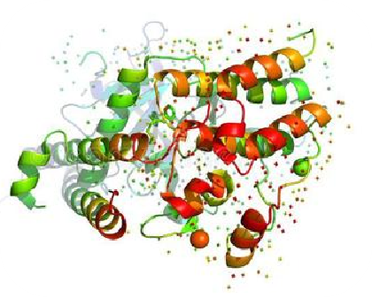

# 赛题描述

在蛋白质冷冻电镜三维重构程序中，将二维真实图像与空间中的三维结构的投影图像的相似度计算是调用最为频繁的计算，相似度计算的原理是求取真实图像与投影图像的所有像素在傅里叶空间中的二范数之和，公式如下：
$$
diff=\sum_{i=1}^{N}{a*||image_i-proj_i||}
$$

比赛的目的是将赛方提供的相似度计算程序进行并行加速，输出结果精度误差不超过十万分之一，比赛的代码包里提供了校验文件。

<!-- more -->

# 运行环境

## 硬件：

处理器：Intel Xeon处理器 Platinum 9242 CPU @ 2.30GHz 24*8G 

网络：100Gb Intel omnipath

## 软件：

操作系统：CentOS 8.0  

并行环境：Intel MPI

相关依赖软件：VTune Profiler 2020、ParaCloud平台的ssh连接工具等

应用负载：96个逻辑核心

# 优化后的代码结构

# 优化过程
## MPI进程级并行优化&MPI-IO优化

对于源代码计算部分的外层循环，通过进程号将大的循环体划分成数个小循环并行执行，多出的子任务分配给进程号最大的进程。I/O方面的优化点在于，通过预先确定结果文件指针的偏移量，每轮计算结果不再直接输出，而是根据偏移量存入当前进程创建的一片内存空间中的对应位置，各进程在计算任务结束后整体写入结果文件中。

### 优化结果&性能指标(MPI)

  

## OpenMP线程级并行优化&AVX优化

利用OpenMP对计算部分的内层循环进行归约优化，简单实现线程级的并行。

对于实际计算部分，我利用了AVX指令改写了原来计算部分的代码，通过调用AVX的512位向量寄存器，一次可以操作512/32=16个float型浮点数(损失的精度在规则范围内)，而一个float型复数会占用2个float型浮点数长度的地址，所以最终能达到8路并行，即一次操作本来需要八轮循环操作的数据，运算速度有较大提升。

### 优化结果&性能指标(MPI+OpenMP)

### 优化结果&性能指标(MPI+OpenMP+AVX+编译优化)

# Vtune测试结果

原程序计算时间为两个半小时左右，经优化后，程序计算时间为12秒左右，加速了735倍。

 

 

 

