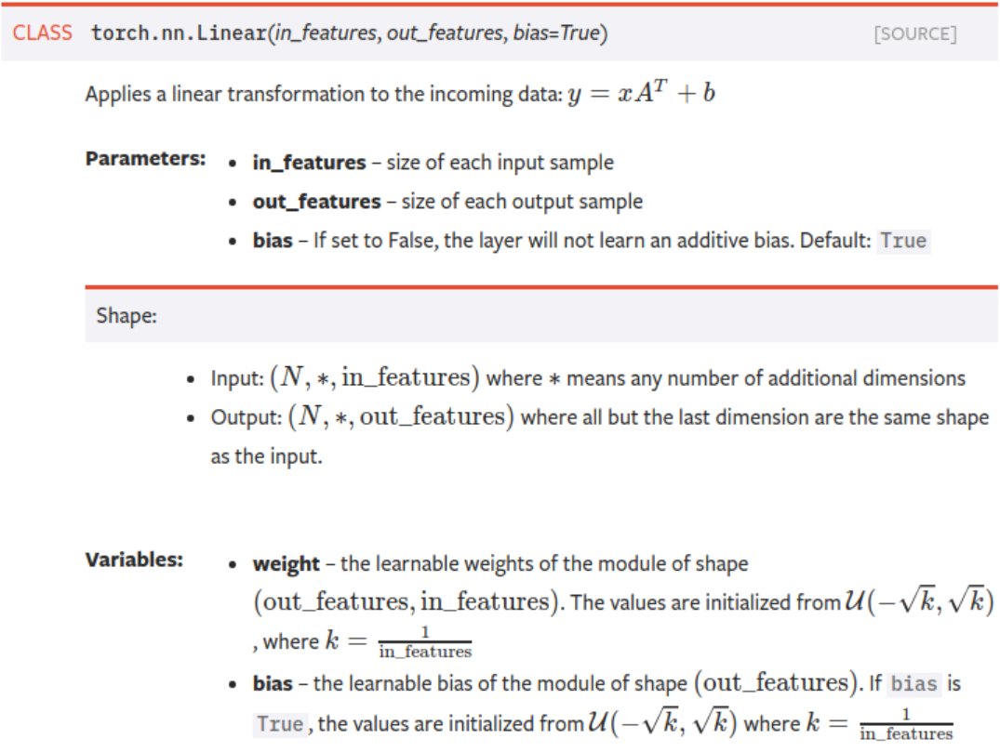

# nn.Linear



<!-- more -->

U指的是均匀分布，即weight权重（A的转置）是取自输入尺寸的倒数再开方后的正负值之间的均匀分布，同理可得偏置bias是输出尺寸的倒数再开方后的正负值之间的均匀分布。

需要实现的内容：
$$
y=x A^{T}+b
$$


返回的是：
$$
\text { input }^{*} \text { weight }+\text { bias }
$$


**1.初始化**

```python
class Linear(Module):
	...
	__constants__ = ['bias']
	def __init__(self, in_features, out_features, bias=True):
	    super(Linear, self).__init__()
	    self.in_features = in_features
	    self.out_features = out_features
	    self.weight = Parameter(torch.Tensor(out_features, in_features))
	    if bias:
	        self.bias = Parameter(torch.Tensor(out_features))
	    else:
	        self.register_parameter('bias', None)
	    self.reset_parameters()
```

**2.计算**

```python
@weak_script_method
    def forward(self, input):
        return F.linear(input, self.weight, self.bias)
```

**3.举例**

```python
import torch
nn1 = torch.nn.Linear(100, 50)
input1 = torch.randn(140, 100)
output1 = nn1(input1)
output1.size()
torch.Size([140, 50])
```

张量的大小由 **140 x 100** 变成了 **140 x 50**

执行的操作是：
$$
[140,100] \times[100,50]=[140,50]
$$
to be continue ...

<br>

<br>

<br>


