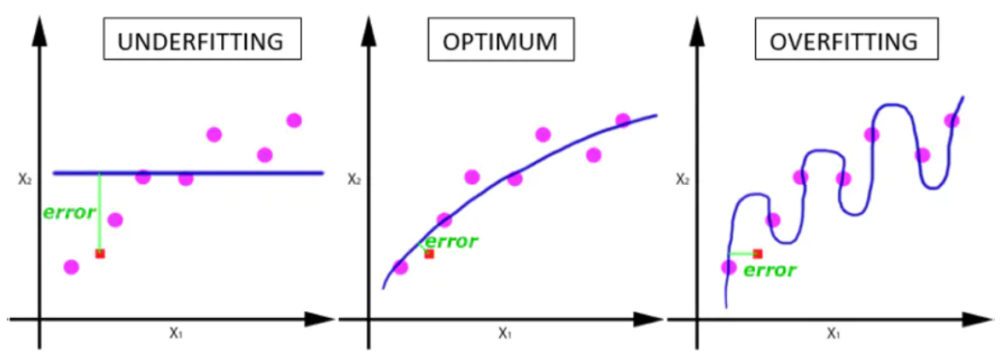

| 
名词
 | 
定义
                                        |
| :-------------------- | :----------------------------------------------------------- |
| **Epoch**             | 使用训练集的全部数据对模型进行一次完整训练，被称之为 **"一代训练"** |
| **Batch**             | 使用训练集中的一小部分样本对模型权重进行一次反向传播的参数更新，这一小部分样本被称为 **"一批数据"** |
| **Iteration**         | 使用一个**Batch**数据对模型进行一次参数更新的过程，被称之为 **"一次训练"** |

<!-- more -->

- **Epoch（时期）：**

  当一个完整的数据集通过了神经网络一次并且返回了一次，这个过程称为一次Epoch。（也就是说，**所有训练样本**在神经网络中都 进行了一次**正向传播** 和一次**反向传播** ）。再通俗一点，一个Epoch就是**将所有训练样本训练一次**的过程。

**然而，当一个Epoch的样本（也就是所有的训练样本）数量可能太过庞大（对于计算机而言），就需要把它分成多个小块，也就是就是分成多个Batch来进行训练。**

- **Batch（批 / 一批样本）：**
   将整个训练样本分成若干个Batch。
- **Batch_Size（批大小）：**
   每批样本的大小。
- **Iteration（一次迭代）：**
   训练一个Batch就是一次Iteration（这个概念跟程序语言中的迭代器相似）。

- **为什么要使用多于一个epoch?**

在神经网络中传递完整的数据集一次是不够的，而且我们需要将完整的数据集在同样的神经网络中传递多次。但请记住，我们使用的是有限的数据集，并且我们使用一个迭代过程即梯度下降来优化学习过程。如下图所示。因此仅仅更新一次或者说使用一个epoch是不够的。

**随着epoch数量增加，神经网络中的权重的更新次数也在增加，曲线从欠拟合变得过拟合。**

**几个epoch才是合适的呢？对于不同的数据集，答案是不一样的。**

- **换算关系**

$$
\text { Number of Batches }=\frac{\text { Training Set Size }}{\text { Batch Size }}
$$

实际上，**梯度下降**的几种方式的根本区别就在于上面公式中的 **Batch_Size** 不同。

| 梯度下降方式   | Training Set Size | Batch Size | Number of Batches |
| -------------- | ----------------- | ---------- | ----------------- |
| **BGD**        | N                 | N          | 1                 |
| **SGD**        | N                 | 1          | N                 |
| **Mini-Batch** | N                 | B          | N/B + 1           |

- **举例**

**MINIST**数据集有 **60000** 张图片作为训练数据，**10000** 张图片作为测试数据。假设现在选择 **Batch_Size = 100** 对模型进行训练。迭代  **30000** 次。

- 每个 Epoch 要训练的图片数量：**60000** (训练集上的所有图像)
- 训练集具有的 Batch 个数： **60000/100=600**
- 每个 Epoch 需要完成的 Batch 个数：**600**
- 每个 Epoch 具有的 Iteration 个数：**600**（完成一个Batch训练，相当于参数迭代一次）
- 每个 Epoch 中发生模型权重更新的次数：**600**
- 训练 10 个Epoch后，模型权重更新的次数： **600\*10=6000**
- 不同Epoch的训练，其实用的是同一个训练集的数据。**第1个Epoch和第10个Epoch虽然用的都是训练集的 60000 张图片，但是对模型的权重更新值却是完全不同的。因为不同Epoch的模型处于代价函数空间上的不同位置，模型的训练代越靠后，越接近谷底，其代价越小。**
- 总共完成 **30000** 次迭代，相当于完成了 **30000/600=50** 个Epoch

 

 

 

