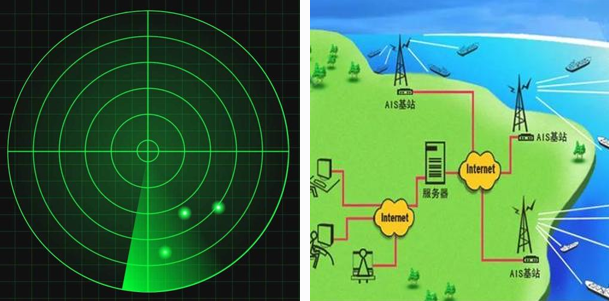
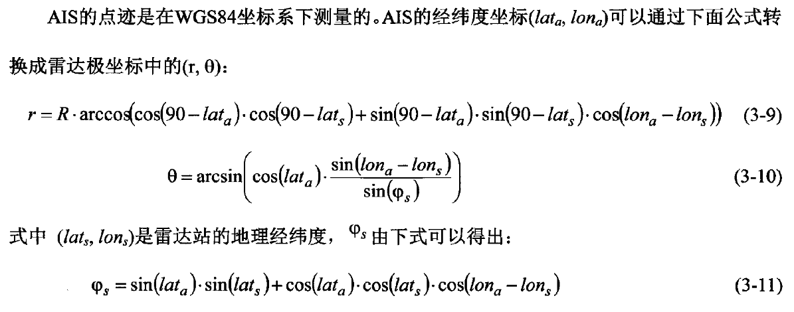
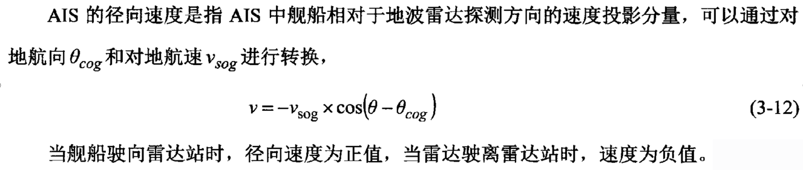
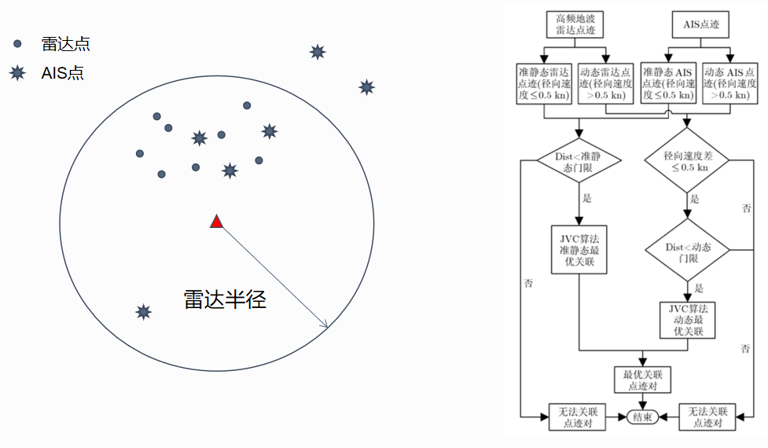
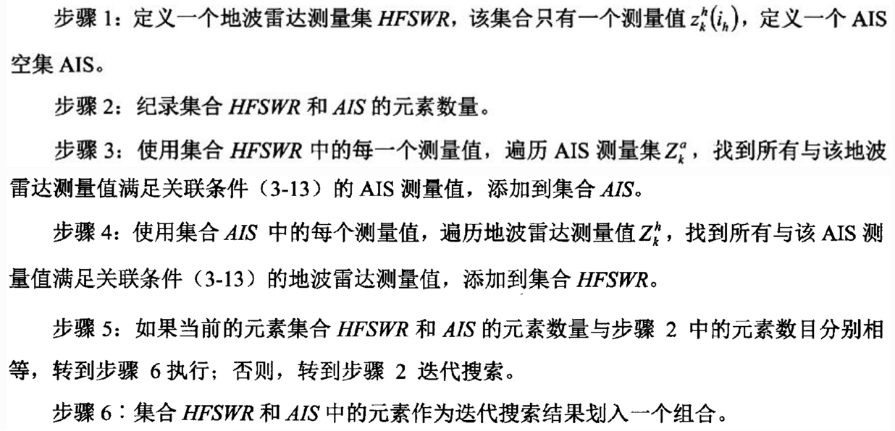
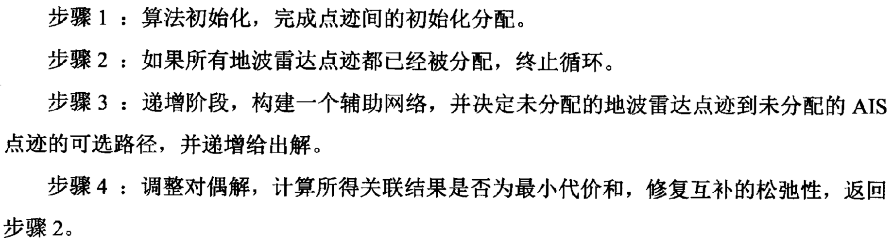
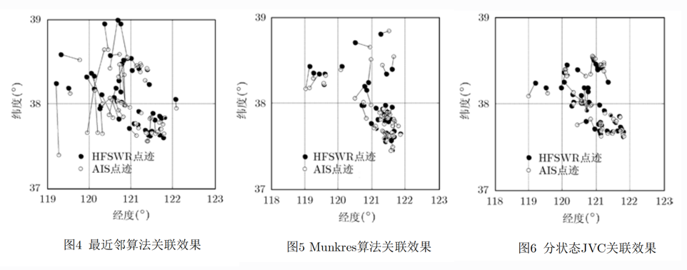
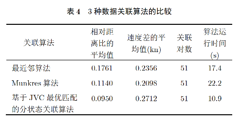
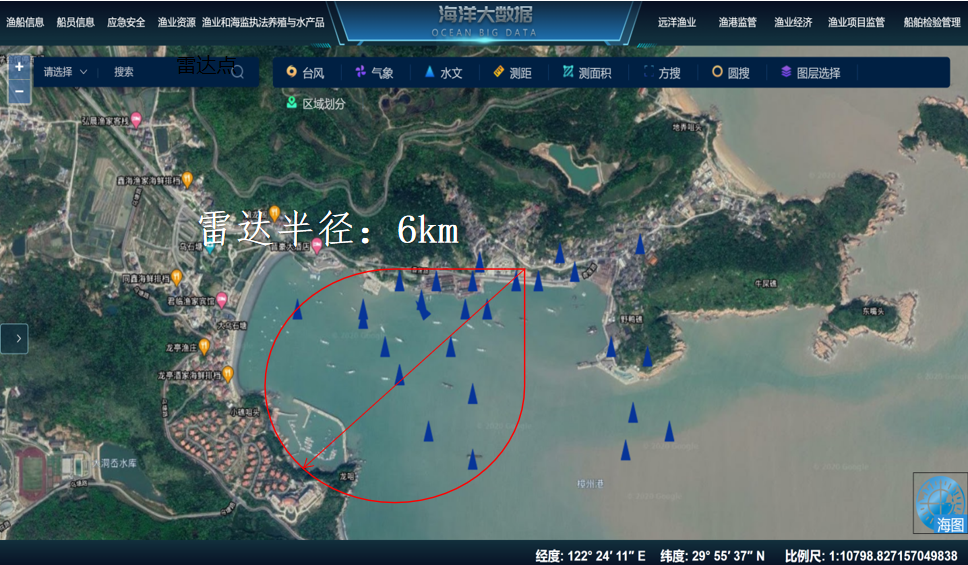
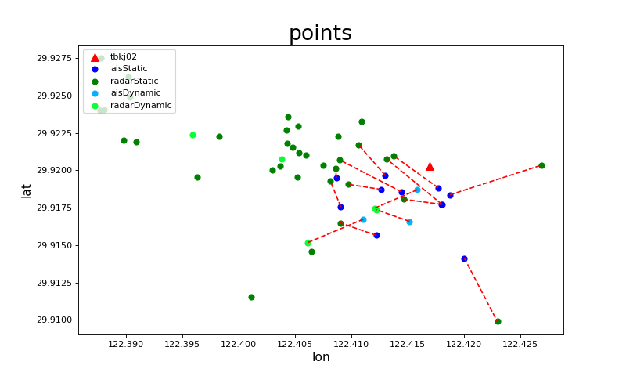

# 问题简介

## 进出港非法渔船研判

研判三要素：

1. 船舶进出港登记人员是否在册（查数据库）√
2. 视频设备获取的船舶id是否在册（查数据库）√
3. 
   雷达扫描到的船舶是否有与之匹配的AIS点位（点迹匹配）？

研判港口渔船的合法性有以上三个要素，其中前两个可以通过简单的数据库查询做出判断，但是第三点由于AIS数据和雷达数据间的弱关联性，需要做进一步处理。

<!-- more -->

# 点迹匹配

一艘合规的船需要有配对的雷达点位和AIS点位，但由于这两个数据的关联性较弱、数据间的发送间隔也不相同，所以两个点位往往有一定的时空误差。

- 雷达数据（被动）：船舶位置、航速、航向、船舶长度、时间等，雷达数据较真实可靠，速度探测精度高，但位置精度低，无法确定到船的具体信息。
- AIS数据（主动）：AIS设备ID（唯一，且与船舶id配对）、船舶位置、航速、航向、温度、时间等，AIS数据能确定到具体某一艘船，但会存在漏报、谎报的情况。

# 研究过程

## 主要步骤

首先，将WGS84(World Geodetic System 1984)坐标系下测量的AIS的点迹和高频地波雷达点迹映射到极坐标中，实现坐标系的统一。
其次，建立高频地波雷达和AIS点迹关联模型，采用状态划分和迭代搜索算法将关联数据集划分为可行的关联子集。
最后，将JVC全局最优关联算法应用于每一个可行关联子集的点迹关联上，解决密集环境中的雷达和AIS点迹关联问题。

### 统一坐标系

### 计算径向速度

### 分状态划分测试集

根据径向速度、距离等信息，利用门限阈值将雷达和AIS数据划分为静态和动态两类，提高运算速度和匹配精度。

### 迭代搜索

### JVC最优点迹匹配

算法输入：代价矩阵（矩阵元是雷达点和AIS点之间的距离）

算法输出：最小总代价，匹配的点迹对

# 算法复现

## 论文实验

论文数据：                                                                                 
2011年10月31日09:18:50时的336个雷达目标点迹（真实数据）和443个AIS点迹（仿真数据）

算法比较：

选用了最近邻算法、Munkres算法、分状态JVC算法进行点迹关联比较，测试结果如下：

实验结果表明，该算法在同样关联51对点迹的情况下，关联精度高于最近邻算法和Munkres法，关联用时少于最近邻算法和Munkres法，为地波雷达与AIS目标点迹关联提供了一种可行的方法，但是，由于雷达的目标定位精度较低，雷达与 AIS 的点迹关联比例较低，下一步可以考虑进一步融合高精度的 SAR 图像数据进行船只点迹目标融合探测，以便提高海洋探测的精度和范围，同时可以起到校准雷达精度的作用。

## 复现实验

实验数据：舟山海域2020年9月11日20:19:03时-2020年9月11日20:21:03的163个雷达点迹和45个AIS点迹进行点迹关联。

# 参考论文

张晖.*舰船目标多手段数据融合探测方法研究*.2016.内蒙古大学,PhD dissertation.

张晖,刘永信,张杰,纪永刚,郑志强.*地波雷达与自动识别系统目标点迹最优关联算法*[J].电子与信息学报,2015,37(03):619-624.

 

 

 

