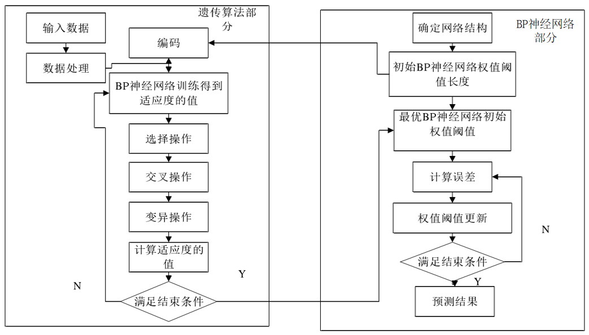

# 概述

**创新点：**

- 深入探讨了基于 BP 神经网络的船舶轨迹预测模型，通过 AIS 数据提供的信息，针对船舶轨迹预测问题，结合遗传算法，改进了 BP 神经网络轨迹预测模型，并且对不同参数对该模型预测精确度和效率的影响做了研究。

- 将船舶特有的轨迹特征与时间序列相结合，提出基于深度学习的RNN-LSTM 模型，分析参数并与 GA-BP 神经网络对比，分析出在海上智能交通轨迹预测的方面，基于时间序列的 LSTM 模型的预测能力更强。

- 利用训练好的模型，提出船舶轨迹预测模型在海上智能交通的应用方面，对目标海域的船舶监控以及异常检测，航路规划等方面。 

  <!-- more -->
  

# 结合遗传算法的 GA-BP 神经网络

遗传算法具有自适应性，全局优化性和隐含并行性，体现出很强的全局搜索能力。然而遗传算法也有自己的缺陷，遗传算法只能搜索到最优解附近，无法搜索到准确的最优解。也就是说，基本上定位到的是“次优解”，以次优解为起点，继而利用 BP 神经网络梯度下降训练算法继续优化权值参数便可以得到遗传算法找不到的最优解位置。两个算法互补，在一定程度上，克服了 BP 神经网络模型经常落入局部最小点的问题。

遗传算法优化 BP神经网络算法流程图

结合两种算法的 GA-BP 神经网络的计算步骤如下： 
1）选取一种编码方案对 BP 网络的连接权值（神经元阈值）进行编码，产生的分布对应着编码前的权值和阈值。 
2）输入训练样本，计算它的误差函数值，选择把预测输出和期望输出之间的绝对误差之和作为适应度值；若误差越小，适应度越大，则当前的连接权值作为染色体则更优，反之适应度就小，当前的连接权值作为染色体则更差一些。 
3）选择操作，将适应度大的个体遗传给下一代 。 
4）对当前群体进化（变异，交叉），产生下一代的群体。 
5）重复上述步骤 2 到 4，BP 网络里的参数（权值和阈值）得到不断进化，直到进化代数达到要求或者达到满意的效果为止  。 
6）步骤 5 完成后，遗传算法得到一组关于 BP 网络参数（权值和阈值）的次优解，再利用 BP 算法进行网络训练得到最优的权值（阈值）。

# 基于 RNN-LSTM 的船舶轨迹预测模型 