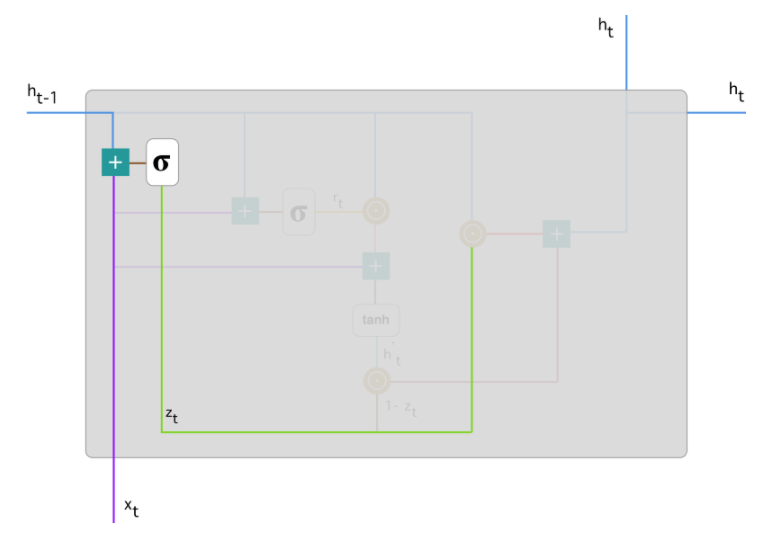

# 简介

GRU 是 gated recurrent units 的缩写，由 Cho在 2014 年提出。GRU 和 LSTM 最大的不同在于 GRU 将遗忘门和输入门合成了一个"更新门"，同时网络不再额外给出记忆状态$C_t$，而是将输出结果$h_t$作为记忆状态不断向后循环传递，网络的输入和输出都变得特别简单。

上述的过程的线性变换没有使用偏置。隐藏状态参数不再是标准RNN的4倍，而是3倍，也就是GRU的参数要比LSTM的参数量要少，但是性能差不多。

GRU 有两个门，即一个重置门（reset gate）和一个更新门（update gate）。从直观上来说，重置门决定了如何将新的输入信息与前面的记忆相结合，更新门定义了前面记忆保存到当前时间步的量。如果我们将重置门设置为1，更新门设置为 0，那么我们将再次获得标准 RNN 模型。使用门控机制学习长期依赖关系的基本思想和 LSTM 一致，但还是有一些关键区别：

- GRU 有两个门（重置门与更新门），而 LSTM 有三个门（输入门、遗忘门和输出门）。
- GRU 并不会控制并保留内部记忆（$C_t$），且没有 LSTM 中的输出门。
- LSTM 中的输入与遗忘门对应于 GRU 的更新门，重置门直接作用于前面的隐藏状态。
- 在计算输出时并不应用二阶非线性。

GRU 是标准循环神经网络的改进版，但到底是什么令它如此高效与特殊？

为了解决标准 RNN 的梯度消失问题，GRU 使用了更新门（update gate）与重置门（reset gate）。基本上，这两个门控向量决定了哪些信息最终能作为门控循环单元的输出。这两个门控机制的特殊之处在于，它们能够保存长期序列中的信息，且不会随时间而清除或因为与预测不相关而移除。

为了解释这个过程的机制，我们将具体讨论以下循环网络中的单元传递过程。

以下展示了单个门控循环单元的具体结构：

首先我们需要指定以下符号：

**1.更新门**

在时间步 t，我们首先需要使用以下公式计算更新门 $z_t$：
$$
z_t = \sigma(W^{(z)}x_t+U^{(z)}h_{t-1})
$$
其中 $x_t$ 为第 t 个时间步的输入向量，即输入序列 X 的第 t 个分量，它会经过一个线性变换（与权重矩阵 $W^{(z)}$ 相乘）。$h_{t-1}$ 保存的是前一个时间步 t-1 的信息，它同样也会经过一个线性变换。更新门将这两部分信息相加并投入到 Sigmoid 激活函数中，因此将激活结果压缩到 0 到 1 之间。以下是更新门在整个单元的位置与表示方法。

更新门帮助模型决定到底要将多少过去的信息传递到未来，或到底前一时间步和当前时间步的信息有多少是需要继续传递的。这一点非常强大，因为模型能决定从过去复制所有的信息以减少梯度消失的风险。我们随后会讨论更新门的使用方法，现在只需要记住 $z_t$ 的计算公式就行。

**2. 重置门**

本质上来说，重置门主要决定了到底有多少过去的信息需要遗忘，我们可以使用以下表达式计算：
$$
r_t = \sigma(W^{(r)}x_t+U^{(r)}h_{t-1})
$$
该表达式与更新门的表达式是一样的，只不过线性变换的参数和用处不一样而已。下图展示了该运算过程的表示方法：

如前面更新门所述，$h_{t-1}$ 和 $x_t$ 先经过一个线性变换，再相加投入 Sigmoid 激活函数以输出激活值。

**3. 当前记忆内容**

现在我们具体讨论一下这些门控到底如何影响最终的输出。在重置门的使用中，新的记忆内容将使用重置门储存过去相关的信息，它的计算表达式为：
$$
h_{t}^{\prime}=\tanh \left(W x_{t}+r_{t} \odot U h_{t-1}\right)
$$
输入 $x_t$ 与上一时间步信息 $h_{t-1}$ 先经过一个线性变换，即分别左乘矩阵 W 和 U。

计算重置门 $r_t$ 与 $Uh_{t-1}$ 的 Hadamard 乘积，即 $r_t$ 与 $Uh_{t-1}$ 的对应元素乘积。因为前面计算的重置门是一个由 0 到 1 组成的向量，它会衡量门控开启的大小。例如某个元素对应的门控值为 0，那么它就代表这个元素的信息完全被遗忘掉。该 Hadamard 乘积将确定所要保留与遗忘的以前信息。

将这两部分的计算结果相加再投入双曲正切激活函数中。该计算过程可表示为：

**4. 当前时间步的最终记忆**

在最后一步，网络需要计算 $h_t$，该向量将保留当前单元的信息并传递到下一个单元中。在这个过程中，我们需要使用更新门，它决定了当前记忆内容 $h'_t$ 和前一时间步 $h_{t-1}$ 中需要收集的信息是什么。这一过程可以表示为：
$$
h_{t}=z_{t} \odot h_{t-1}+\left(1-z_{t}\right) \odot h_{t}^{\prime}
$$
$z_t$ 为更新门的激活结果，它同样以门控的形式控制了信息的流入。$z_t$ 与 $h_{t-1}$ 的 Hadamard 乘积表示前一时间步保留到最终记忆的信息，该信息加上当前记忆保留至最终记忆的信息就等于最终门控循环单元输出的内容。

以上表达式可以展示为：

现在我们应该比较了解到底 GRU 是如何通过更新门与重置门存储并过滤信息。门控循环单元不会随时间而清除以前的信息，它会保留相关的信息并传递到下一个单元，因此它利用全部信息而避免了梯度消失问题。

 

 

 

