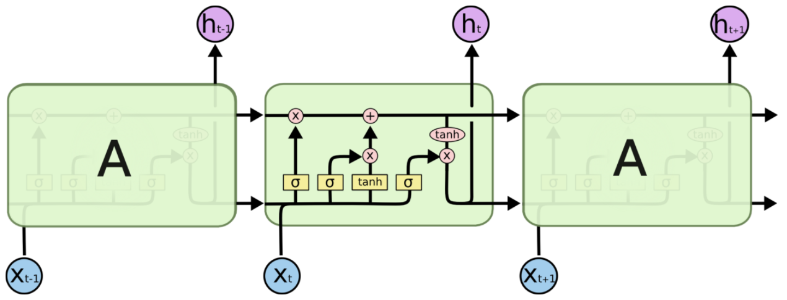

# 简介

LSTM 是 Long Short Term Memory Networks 的缩写，按字面翻译就是长的短时记忆网络。长时依赖是这样的一个问题，当预测点与依赖的相关信息距离比较远的时候，就难以学到该相关信息。例如在句子“我出生在法国，……   ，我会说法语”中，若要预测末尾“法语”，我们需要用到上下文“法国”。理论上，递归神经网络是可以处理这样的问题的，但是实际上，常规的递归神经网络并不能很好地解决长时依赖，好的是LSTMs可以很好地解决这个问题。

<!-- more -->

Long Short Term Mermory network（LSTM）是一种特殊的RNNs，可以很好地解决长时依赖问题。那么它与常规神经网络有什么不同？
首先我们来看RNNs具体一点的结构：

所有的递归神经网络都是由重复神经网络模块构成的一条链，可以看到它的处理层非常简单，通常是一个单tanh层，通过当前输入及上一时刻的输出来得到当前输出。与神经网络相比，经过简单地改造，它已经可以利用上一时刻学习到的信息进行当前时刻的学习了。

LSTM的结构与上面相似，不同的是它的重复模块会比较复杂一点，它有四层结构：

其中，处理层出现的符号及表示意思如下：

## **LSTMs的核心思想**

理解LSTMs的关键就是下面的矩形方框，被称为memory block（记忆块），主要包含了三个门（遗忘门、输入门、输出门）与一个记忆单元（cell）。方框内上方的那条水平线，被称为cell state（单元状态），它就像一个传送带，可以控制信息传递给下一时刻。

这个矩形方框还可以表示为：

这两个图可以对应起来看，下图中心的$c_t$即cell，从下方输入（$ h_{t−1},x_t$）到输出$h_t$的一条线即为cell state，$f_t$，$i_t$，$o_t$分别为遗忘门、输入门、输出门，用sigmoid层表示。上图中的两个tanh层则分别对应cell的输入与输出。

LSTM可以通过门控单元可以对cell添加和删除信息。通过门可以有选择地决定信息是否通过，它有一个sigmoid神经网络层和一个成对乘法操作组成，如下：

该层的输出是一个介于0到1的数，表示允许信息通过的多少，0 表示完全不允许通过，1表示允许完全通过。

# **逐步解析LSTM**

标准的循环神经网络内部只有一个简单的层结构，而 LSTM 内部有 4 个层结构：

第一步是忘记：决定状态中丢弃什么信息

第二步用来产生更新值的候选项，说明状态在某些维度上需要加强，在某些维度上需要减弱

第三步是输入，它的输出值要乘到tanh层的输出上，起到一个缩放的作用，极端情况下sigmoid输出0说明相应维度上的状态不需要更新

第四步决定输出什么，输出值跟状态有关。候选项中的哪些部分最终会被输出由一个sigmoid来决定。

pytorch 中使用 nn.LSTM 类来搭建基于序列的循环神经网络，他的参数基本与RNN类似。

## 第一步

LSTM第一步是用来决定什么信息可以通过cell state。这个决定由“forget gate”层通过sigmoid来控制，它会根据上一时刻的输出$h_{t-1}$和当前输入$x_t$来产生一个0到1的$f_t$值，来决定是否让上一时刻学到的信息$C\_{t−1}$通过或部分通过。如下：

举个例子来说就是，我们在之前的句子中学到了很多东西，一些东西对当前来讲是没用的，可以对它进行选择性地过滤。

## 第二步

第二步是产生我们需要更新的新信息。这一步包含两部分，第一个是一个“input gate”层通过sigmoid来决定哪些值用来更新，第二个是一个tanh层用来生成新的候选值$\widetilde{C}_t$，它作为当前层产生的候选值可能会添加到cell state中。我们会把这两部分产生的值结合来进行更新。

## 第三步

现在我们对老的cell state进行更新，首先，我们将老的cell state乘以\$f_t$来忘掉我们不需要的信息，然后再与$i_t∗\widetilde{C}_t$相加，得到了候选值。

一二步结合起来就是丢掉不需要的信息，添加新信息的过程：

举个例子就是，在前面的句子中我们保存的是张三的信息，现在有了新的李四信息，我们需要把张三的信息丢弃掉，然后把李四的信息保存下来。

## 第四步

最后一步是决定模型的输出，首先是通过sigmoid层来得到一个初始输出，然后使用tanh将$C_t$值缩放到-1到1间，再与sigmoid得到的输出逐对相乘，从而得到模型的输出。

这显然可以理解，首先sigmoid函数的输出是不考虑先前时刻学到的信息的输出，tanh函数是对先前学到信息的压缩处理，起到稳定数值的作用，两者的结合学习就是递归神经网络的学习思想。至于模型是如何学习的，那就是后向传播误差学习权重的一个过程了。

 

 

 

