# 简介

LSTM 是 Long Short Term Memory Networks 的缩写，按字面翻译就是长的短时记忆网络。长时依赖是这样的一个问题，当预测点与依赖的相关信息距离比较远的时候，就难以学到该相关信息。例如在句子“我出生在法国，……   ，我会说法语”中，若要预测末尾“法语”，我们需要用到上下文“法国”。理论上，递归神经网络是可以处理这样的问题的，但是实际上，常规的递归神经网络并不能很好地解决长时依赖，好的是LSTMs可以很好地解决这个问题。

<!-- more -->

Long Short Term Mermory network（LSTM）是一种特殊的RNNs，可以很好地解决长时依赖问题。那么它与常规神经网络有什么不同？
首先我们来看RNNs具体一点的结构：

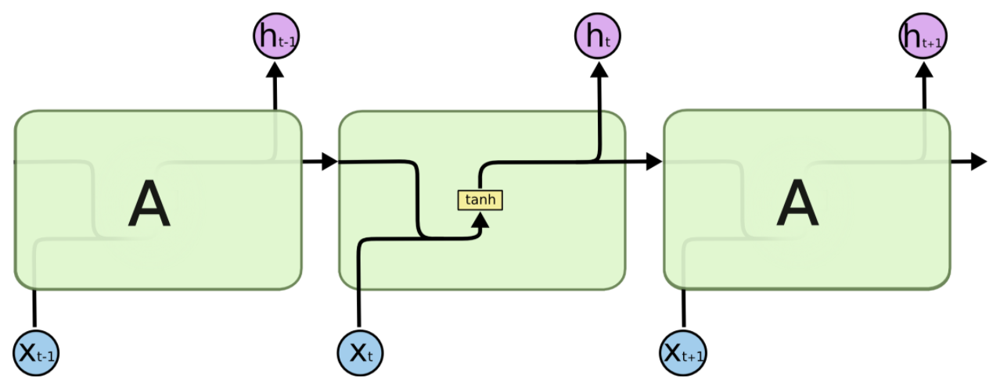

所有的递归神经网络都是由重复神经网络模块构成的一条链，可以看到它的处理层非常简单，通常是一个单tanh层，通过当前输入及上一时刻的输出来得到当前输出。与神经网络相比，经过简单地改造，它已经可以利用上一时刻学习到的信息进行当前时刻的学习了。

LSTM的结构与上面相似，不同的是它的重复模块会比较复杂一点，它有四层结构：

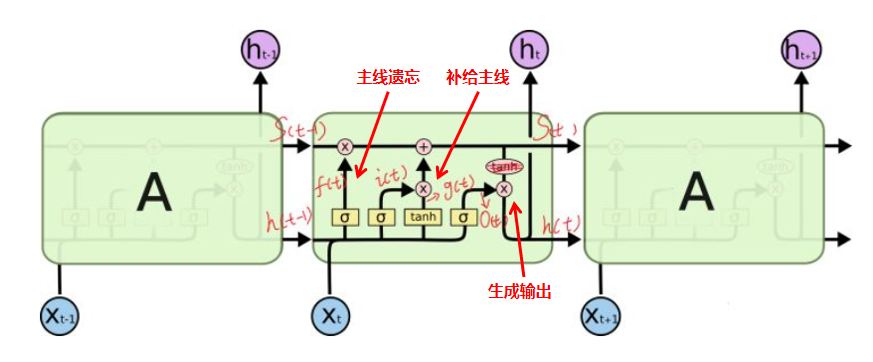

其中，处理层出现的符号及表示意思如下：

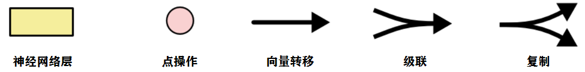

如果把LSTM当成黑盒子看待，可以分为以下关键变量：

- 输入：$h_{t-1}$（t-1时刻的隐藏层）和$x_t$（t时刻的特征向量）
- 输出：$h_t$（加softmax即可作为真正输出，否则作为隐藏层）
- 主线/记忆：$c_{t-1}$和$c_t$

依次分类的依据为：

- 参考黄色部分，$h_{t-1}$和$x_t$联合起来控制了三个门，并且是输入的唯一来源，所以划分为输入部分。
- 图中往上跑的$h_t$，它与真正的输出只隔了一层softmax（图中未画出），是输出的直接来源，所以划分为输出部分。当然它同时又是下一个LSTM cell的输入（图中往右跑的$h_t$），但是在当前cell，它仅与输出相关。
- 如图黄色部分，$c_{t-1}$和$c_t$始终与外界隔离开来，显然是作为LSTM记忆或者主线的存在。主线进来后，首先受到遗忘门的衰减作用，接着输入门控制“补给大小”给主线补充能量生成全新的主线。这一衰一补的过程完成了主线的更新。接着在输出门的控制下生成新的输出$h_t$。


## **LSTMs的核心思想**

理解LSTMs的关键就是下面的矩形方框，被称为memory block（记忆块），主要包含了三个门（遗忘门、输入门、输出门）与一个记忆单元（cell）。方框内上方的那条水平线，被称为cell state（单元状态），它就像一个传送带，可以控制信息传递给下一时刻。

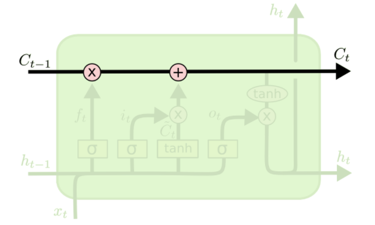

这个矩形方框还可以表示为：

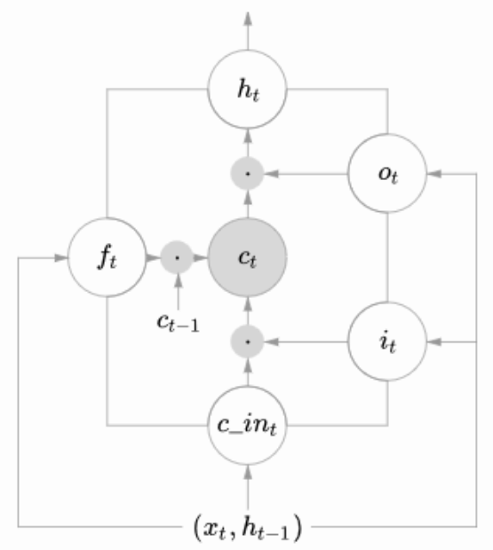

这两个图可以对应起来看，下图中心的$c_t$即cell，从下方输入（$ h_{t−1},x_t$）到输出$h_t$的一条线即为cell state，$f_t$，$i_t$，$o_t$分别为遗忘门、输入门、输出门，用sigmoid层表示。上图中的两个tanh层则分别对应cell的输入与输出。

LSTM可以通过门控单元可以对cell添加和删除信息。通过门可以有选择地决定信息是否通过，它有一个sigmoid神经网络层和一个成对乘法操作组成，如下：

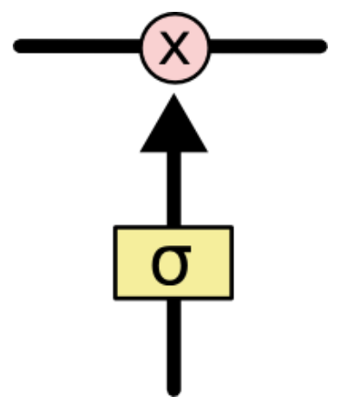

该层的输出是一个介于0到1的数，表示允许信息通过的多少，0 表示完全不允许通过，1表示允许完全通过。

# **逐步解析LSTM**

**下面开始进一步介绍这四个状态在LSTM内部的使用（敲黑板）**

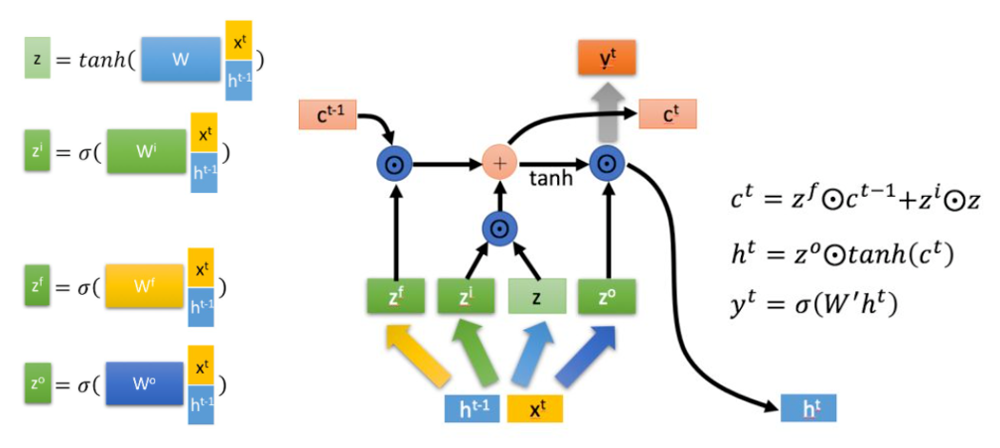

$\bigodot$是Hadamard Product，也就是操作矩阵中对应的元素相乘，因此要求两个相乘矩阵是同型的。$\bigoplus$则代表进行矩阵加法。

## 第一步

LSTM第一步是用来决定什么信息可以通过cell state。这个决定由“forget gate”层通过sigmoid来控制，它会根据上一时刻的输出$h_{t-1}$和当前输入$x_t$来产生一个0到1的$f_t$值，来决定是否让上一时刻学到的信息$C_{t−1}$通过或部分通过。如下：

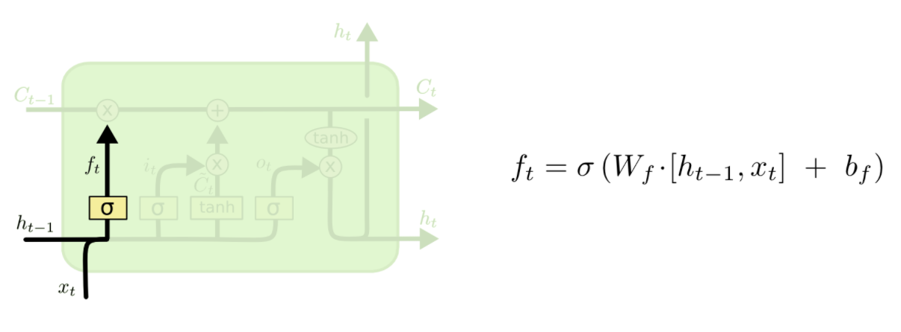

举个例子来说就是，我们在之前的句子中学到了很多东西，一些东西对当前来讲是没用的，可以对它进行选择性地过滤。

## 第二步

第二步是产生我们需要更新的新信息。这一步包含两部分，第一个是一个“input gate”层通过sigmoid来决定哪些值用来更新，第二个是一个tanh层用来生成新的候选值$\widetilde{C}_t$，它作为当前层产生的候选值可能会添加到cell state中。我们会把这两部分产生的值结合来进行更新。

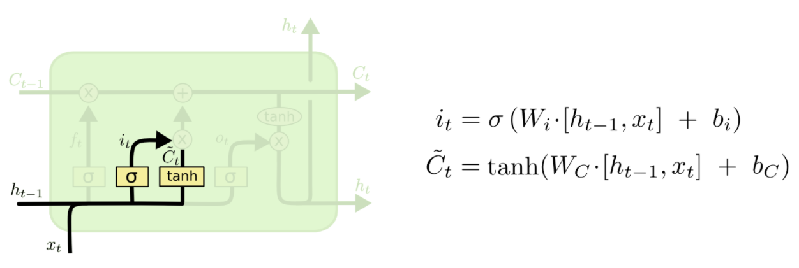

## 第三步

现在我们对老的cell state进行更新，首先，我们将老的cell state乘以$f_t$来忘掉我们不需要的信息，然后再与$i_t∗\widetilde{C}_t$相加，得到了候选值。

一二步结合起来就是丢掉不需要的信息，添加新信息的过程：


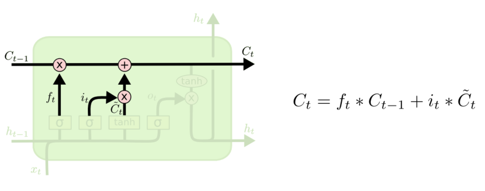

举个例子就是，在前面的句子中我们保存的是张三的信息，现在有了新的李四信息，我们需要把张三的信息丢弃掉，然后把李四的信息保存下来。

## 第四步

最后一步是决定模型的输出，首先是通过sigmoid层来得到一个初始输出，然后使用tanh将$C_t$值缩放到-1到1间，再与sigmoid得到的输出逐对相乘，从而得到模型的输出。

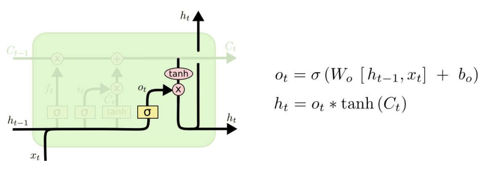

这显然可以理解，首先sigmoid函数的输出是不考虑先前时刻学到的信息的输出，tanh函数是对先前学到信息的压缩处理，起到稳定数值的作用，两者的结合学习就是递归神经网络的学习思想。至于模型是如何学习的，那就是后向传播误差学习权重的一个过程了。

# LSTM IN PyTorch

pytorch 中使用 nn.LSTM 类来搭建基于序列的循环神经网络，他的参数基本与RNN类似。

- LSTM的输入总是一个3D数组.  (batch_size, time_steps, seq_len)

- LSTM的输出根据return_sequences参数可以是2D或3D数组

- 若return_sequences是False，则输出是2D数组.  (batch_size, units)

- 若return_sequences是True，则输出是3D数组.  (batch_size, time_steps, units)

PyTorch提供了从LSTMs，CNNs和GRUs等层到SGD，Adam等优化器的大多数常用实体的实现。使用这些实体中任何一个的一般范例是首先创建带有某些必需参数的torch.nn.entity实例。例如，这是我们实例化lstm的方法：

```python
  # Step 1
  lstm = torch.nn.LSTM(input_size=5, hidden_size=10, batch_first=True)
```

接下来，当我们实际上想在某些输入上运行LSTM时，将输入作为参数来调用该对象。这在下面的第三行中显示：

```python
lstm_in = torch.rand(40, 20, 5)
hidden_in = (torch.zeros(1, 40, 10), torch.zeros(1, 40, 10)) #(h0,c0)
# Step 2
lstm_out, lstm_hidden = lstm(lstm_in, hidden_in)
```

**关于维度注意：**

在常规范例的第2步中，torch.nn.LSTM期望输入为大小为（seq_len，batch，embedding_dim）的3D输入张量，并返回大小为（seq_len，batch，hidden_dim）的输出张量。

例如，考虑输入输出对（“ ERPDRF”，“ SECRET”）这两个单词。使用embedding_dim为5时，将6个字母长的输入ERPDRF转换为大小为6 x 1 x 5的输入张量。如果hidden_dim为10，则LSTM将输入处理为大小为6 x 1 x 10的输出张量。

**输出转换：**

一般的解决方法是通过所谓的线性变换将D维张量转换为V维张量。除了定义之外，其思想是使用矩阵乘法来获得所需的尺寸。

假设LSTM产生了一个输出张量O，大小为seq_len x batch x hidden_dim。回想一下，我们一次只提供一个示例，因此batch始终为1。这实际上为我们提供了一个输出张量O，大小为seq_len x hidden_dim。现在，如果我们将此输出张量与大小为hidden_dim x  embedding_dim的另一个张量W相乘，则所得张量 R = O×W 的大小为seq_len x embedding_dim。这正是我们想要的。

为了实现线性层，我们创建一个torch.nn.Linear实例。这次，文档将所需参数列出为in_features：每个输入样本的大小，out_features：每个输出样本的大小。请注意，这仅会变换输入张量的最后一个维度。因此，例如，如果我们传入大小为（d1，d2，d3，...，dn，in_features）的输入张量，则输出张量将具有除最后一个维度以外的所有尺寸，并且将为大小（d1，d2，d3，...，dn，out_features）。

<br>

<br>

<br>

