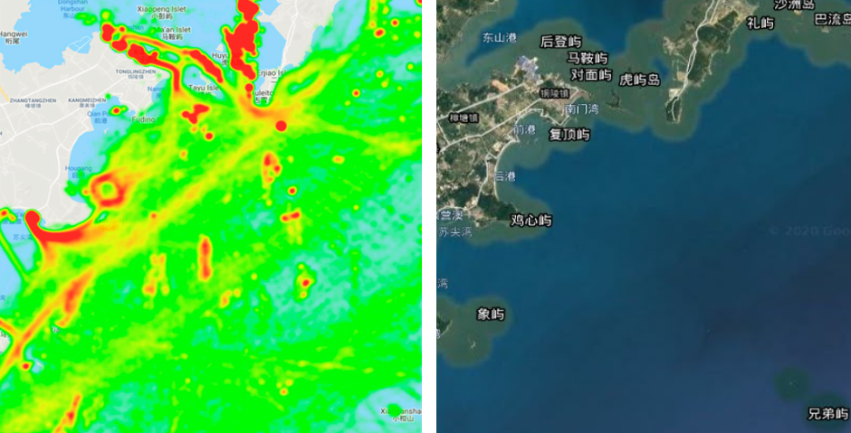
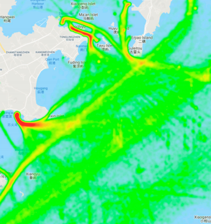
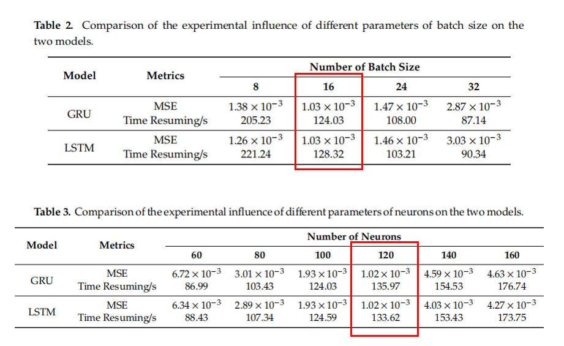
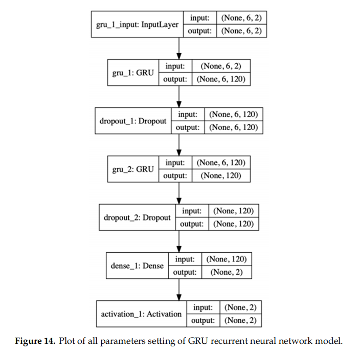
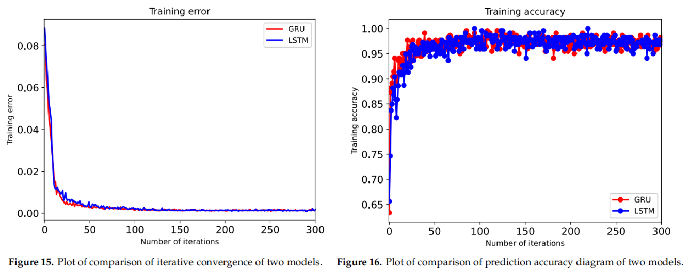
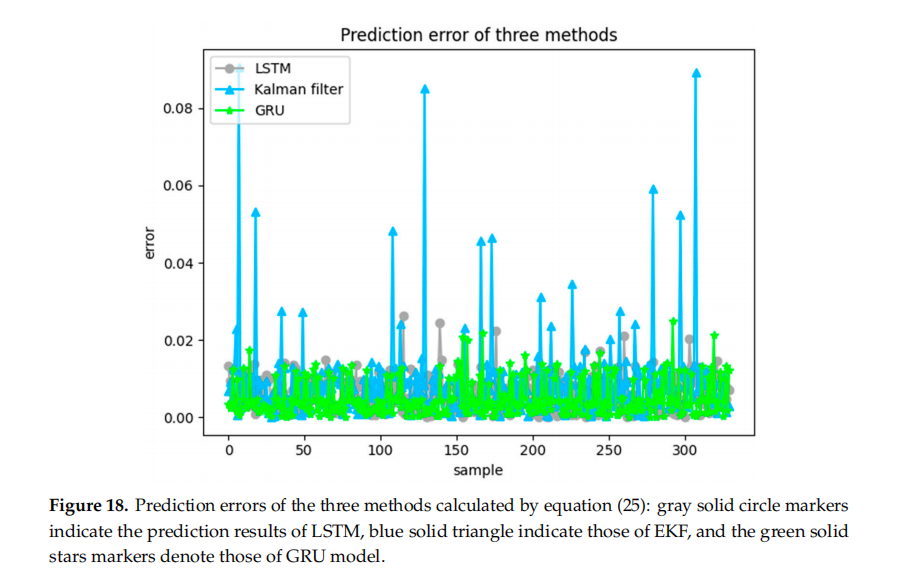
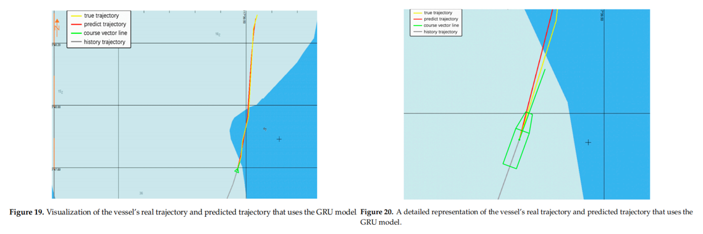

# 数据选取

中国漳州港AIS原始数据：

# 预测模型总体框架

<!--more-->

# 数据预处理

**连续轨迹$V_i$的要求：**连续的两个状态$R_i$和$R_{i-1}$的$mmsi$（水上移动通信业务标识码）相同，发送间隔不超过20min

**优化轨迹$T_{si}$的要求：**将$V_i$放入优化器$Optimize(·)$后获得的轨迹，所谓优化器是对含有突变速度、突变位置的点进行的平滑操作

与初始数据相比，预处理后的坐标总数减少了近71.8%，轨迹数减少了近92.1%，因为只有正在行进的船只被保存为有效轨迹（锚定或漂移被过滤）。 几乎所有的噪声数据都从原始数据中消除，得到了更有效、更规则的船舶轨迹，提高了处理效率。

# 聚类分析

目的：利用基于历史AIS数据的轨迹聚类模型生成常规航行路线模式，每种模式单独预测。利用DBSCAN算法粗略的把航迹分类为：1.进入水道  2.穿过水道  3.南北航线

# 轨迹相似性测量

**目的：**传入数据的质量对船只轨迹的预测有重要影响，需要解决每个轨迹的形状差异很大，有很多多余的与目标轨迹无关的数据的问题。

**使用对称段路径距离（SSPD）的数据预处理算法：**首先，让数据预处理后的历史轨迹和通过计算每个轨迹之间的相似系数来评估目标轨迹。第二，根据相似系数触发滤波过程。最后，相关的子集获得满足条件的轨迹数据。

# 模型分析

通过实验选定最优模型参数：

GRU构造由以下几个部分组成：完全连接层、激活层、两个GRU层和一个Dropout层。 第二层gru_1和第四层gru_2是GRU层，每层包含120个隐藏单元；第三层和第五层是Dropout，它不仅可以确保模型在训练过程中丢失信息时保持模型的鲁棒性，而且还可以用于正则化，减少权重连接，在丢失个体连接信息时增加网络模型的鲁棒性；第六层是一个完全连接的层，包含两个神经元；第七层是激活层。

在训练过程中，如图15所示，两个模型都快速迭代，训练损失值可以快速获得更好的收敛效果。 当训练轮数约为30轮时，GRU已达到极值；LSTM作为Baseline，在50轮时达到极值。 基于LSTM的改进GRU模型在训练阶段比LSTM模型更快地收敛到极值点。 收敛速度快主要是由于LSTM结构的门设计采用了简化的GRU门结构。当训练阶段达到30轮左右时，GRU模型的准确率达到96%；从第200轮到第300轮的准确率达到98%左右；然后逐渐平滑，同样说明GRU的效率优于LSTM。

使用LSTM、扩展卡尔曼滤波(EKF)和GRU模型预测了330组轨迹数据。 从实验结果来看，深度学习方法优于传统的基于统计的方法EKF；EKF的预测结果良好，但与深度学习相比，由于数据的强非线性，预测误差不稳定，出现了更大的误差。 基于相同的框架，GRU和LSTM的预测结果相对相似，误差基本稳定在0.02以内， 具有相似的预测精度。

# 结果可视化&结论

从中国漳州港的历史AIS数据中选择一条船舶轨迹，在电子海图显示和信息系统(ECDIS)中可视化，如图19和20所示。灰色线表示观察到的历史轨迹，直到当前时间，红色线表示预测的轨迹，黄色线表示路径第30分钟的地面真实轨迹，绿色线表示船只的航向矢量条。 轨迹中有一个转折点，可以验证我们的模型可以应用于非线性数据。 预测轨迹与实际轨迹几乎重合，取得了良好的预测效果：

 

 

 

