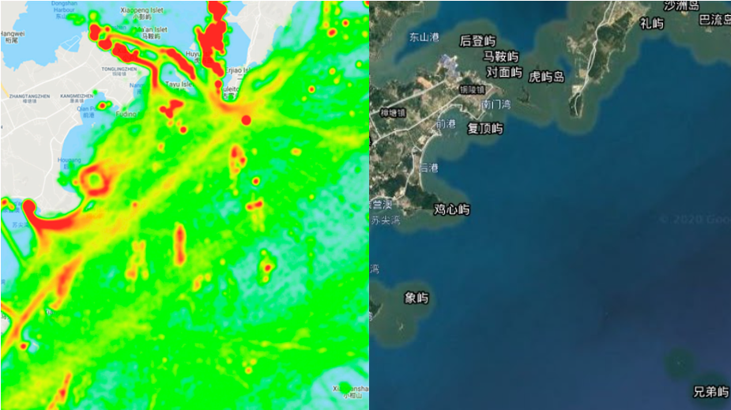
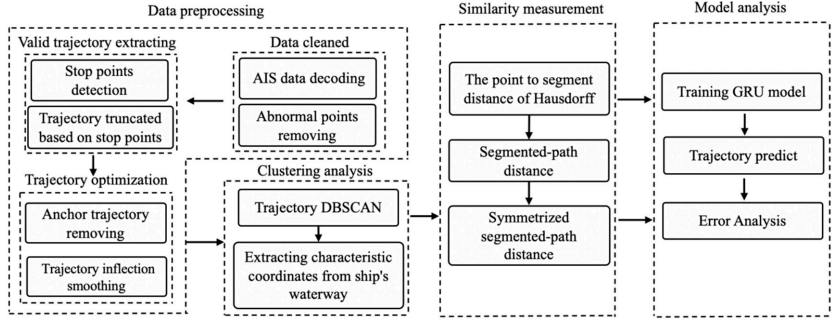
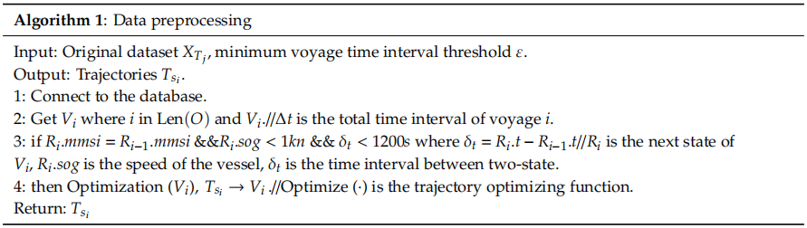
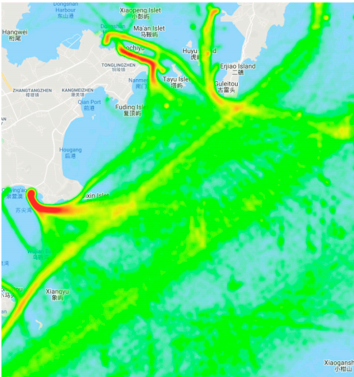
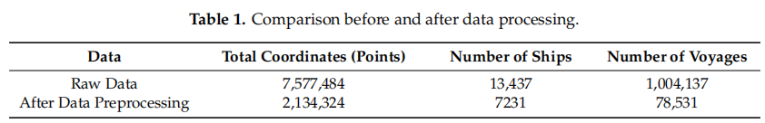
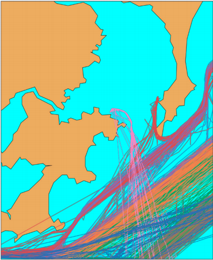
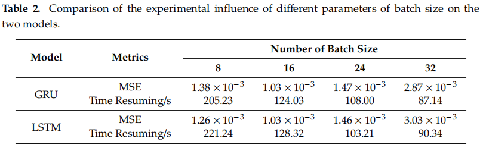
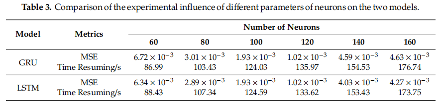

# 数据选取

中国漳州港AIS原始数据：

# 预测模型框架

## 数据预处理

连续轨迹$V_i$的要求：连续的两个状态$R_i$和$R_{i-1}$的mmsi（水上移动通信业务标识码）相同，发送间隔不超过20min

优化轨迹$T_{si}$的要求：将$V_i$放入优化器Optimize(·)后获得的轨迹，所谓优化器是对含有突变速度、突变位置的点进行的平滑操作

与初始数据相比，预处理后的坐标总数减少了近71.8%，轨迹数减少了近92.1%，因为只有正在行进的船只被保存为有效轨迹（锚定或漂移被过滤）。 几乎所有的噪声数据都从原始数据中消除，得到了更有效、更规则的船舶轨迹，提高了处理效率。

## 聚类分析

目的：利用基于历史AIS数据的轨迹聚类模型生成常规航行路线模式，每种模式单独预测。

利用DBSCAN算法粗略的把航迹分类为：1.进入水道  2.穿过水道  3.南北航线

## 轨迹相似性测量

目的：传入数据的质量对船只轨迹的预测有重要影响，需要解决每个轨迹的形状差异很大，有很多多余的与目标轨迹无关的数据的问题。

使用对称段路径距离（SSPD）的数据预处理算法：首先，让数据预处理后的历史轨迹和通过计算每个轨迹之间的相似系数来评估目标轨迹。第二，根据相似系数触发滤波过程。最后，相关的子集获得满足条件的轨迹数据。

## 模型分析

比对了LSTM和GRU，发现在精度相似的情况下，GRU的时间效率高于LSTM

