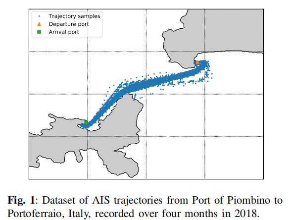
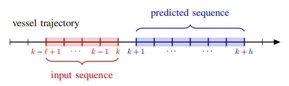
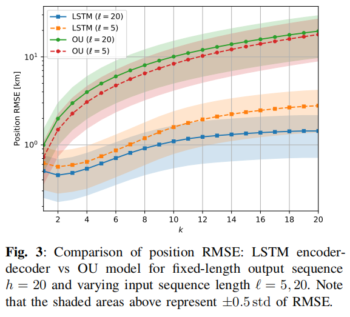
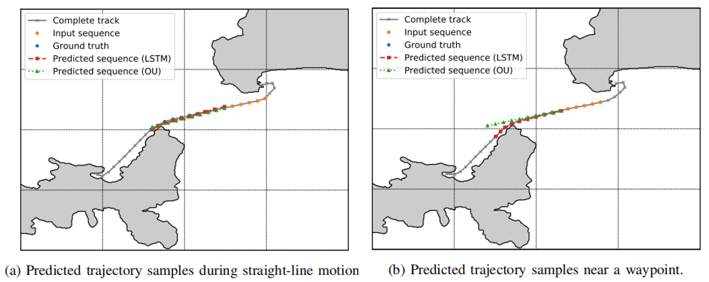

# 摘要

本文的目标是在训练阶段学习使用历史数据的海上交通模式的预测分布，以便能够在提取的知识和可用的观测序列的基础上在线预测未来的目标轨迹样本。探索基于长期短期记忆(LSTM)编解码器体系结构的神经序列到序列模型，以有效地捕获序列AIS数据的长期时间依赖性，并提高整体预测能力。最后在一个真实的AIS数据集上的实验评估表明了序列到序列递归神经网络(RNNs)在船舶轨迹预测中的有效性，并显示了它们与基于模型的方法相比的潜在好处。

# 数据集

2018年6月至9月期间，来自意大利Piombino港到Portoferraio港的534艘不同的船只航行轨迹。

<!--more-->

# 问题描述

# 轨迹预测的相关方法

**NCV模型：**

[1] Z. Xiao, X. Fu, L. Zhang, and R. S. M. Goh, “Traffic pattern mining and forecasting technologies in maritime traffic service networks: A comprehensive survey,” IEEE *Transactions on Intelligent Transportation Systems* , pp.1–30, 2019.

- [x] **OU随机过程:**

[2] L. M. Millefifiori, P. Braca, K. Bryan, and P. Willett, “Modeling vessel kinematics using a stochastic mean-reverting process for long-term prediction,” *IEEE Transactions on Aerospace and Electronic Systems*, vol. 52, no. 5, pp. 2313–2330, 2016.

[3] L. M. Millefifiori, G. Pallotta, P. Braca, S. Horn, and K. Bryan, “Validation of the Ornstein-Uhlenbeck route propagation model in the Mediterranean Sea,” in *MTS/IEEE OCEANS*, 2015.

[4] M. Uney, L. M. Millefifiori, and P. Braca, “Data driven vessel trajectory forecasting using stochastic generative models,” in *IEEE International Conference on Acoustics, Speech and Signal Processing (ICASSP)*, 2019, pp. 8459–8463.

**自适应核密度估计:**

[9] B. Ristic, B. La Scala, M. Morelande, and N. Gordon, “Statistical analysis of motion patterns in AIS data: Anomaly detection and motion prediction,” in *International Conference on Information Fusion* , 2008.

**最邻近搜索算法:**

[10] S. Hexeberg, A. L. Flaten, B. H. Eriksen, and E. F.Brekke, “AIS-based vessel trajectory prediction,” in *International Conference on Information Fusion*, 2017.

**非线性滤波技术:**

[11] F. Mazzarella, V. F. Arguedas, and M. Vespe, “Knowledge-based vessel position prediction using historical AIS data,” in *Sensor Data Fusion: Trends, Solutions, Applications* , 2015.

**机器学习:**

[12] A. Valsamis, K. Tserpes, D. Zissis, D. Anagnostopoulos, and T. Varvarigou, “Employing traditional machine learning algorithms for big data streams analysis: The case of object trajectory prediction,” *Journal of Systems and Software* , vol. 127, pp. 249–257, 2017.

[13] D. Nguyen, R. Vadaine, G. Hajduch, R. Garello, and R. Fablet, “A multi-task deep learning architecture for maritime surveillance using AIS data streams,”  *IEEE International Conference on Data Science and Advanced Analytics* , pp. 331–340, 2018.

[14] D.-D. Nguyen, C. L. Van, and M. I. Ali, “Vessel trajectory prediction using sequence-to-sequence models over spatial grid,” in  *ACM International Conference on Distributed and Event-based Systems* , 2018, pp. 258–261.

**意图预测的桥接分布技术:**

[15] B. I. Ahmad, P. M. Langdon, and S. J. Godsill, “A Bayesian framework for intent prediction in object tracking,” in  *IEEE International Conference on Acoustics, Speech and Signal Processing (ICASSP)* , 2019, pp. 8439–8443.

# 模型建立

使用了LSTM encoder-decoder架构，关键的思想是首先将输入序列编码成连续空间表示或者上下文$c$，以总结低维向量中观察到的信息，最后生成基于此上下文的预测序列，这个问题类似于机器翻译，输入语言中的一个单词序列被翻译成输出语言中的一个单词序列。

该体系结构采用两个LSTM网络，即编码器和解码器，编码器读取输入序列$x_1, \ldots, x_{\ell}$，该序列通过加权连接到一堆递归连接的隐藏层，以获得固定维向量表示或输入$c$的上下文。经过多次递归更新后，最终的单元状态向量c从编码器传递到解码器，解码器递归地从该向量生成输出序列$y_{1}, \ldots, y_{h}$。从概率的角度看，LSTM编解码器模型的目标是通过首先获得LSTM最后一个隐藏状态给出的输入序列的固定维数表示来学习条件分布$p\left(y_{1}, \ldots, y_{h} \mid x_1, \ldots, x_{\ell}\right)$。然后，给定编码器单元状态$c$，条件分布可以近似为：
$$
p\left(y_1, \ldots, y_h \mid x_1, \ldots, x_{\ell}\right)=\prod_{k=1}^{h} p\left(y_{k} \mid c, y_{k-1}, \ldots, y_{1}\right)
$$

# 实验

输入序列首先被传递到64个单元的LSTM中进行编码，然后，通过大小为32的LSTM解码器对编码进行解码。使用RMSprop优化器对预测网络进行训练，learning rate r = 0.001，batch size b = 200, epochs m = 200，输入序列长度l=5或20，输出序列长度h=20。基于OU模型的预测方法作为baseline。

相对于现有的最先进的OU方法，LSTM编解码模型获得了具有竞争力的性能：OU模型的一个特性是预测位置的误差方差随时间线性增长，而当使用LSTM网络时，方差的标度律变成次线性。  结果表明，随着输入序列长度的增加，基于LSTM的方法的性能在较长的范围内趋于改善。

直线轨迹预测时，两者表现得都不错，但是含有waypoint的轨迹LSTM预测的更好。

# 未来工作

作者想结合OU模型和LSTM模型的优点

 

 

 

